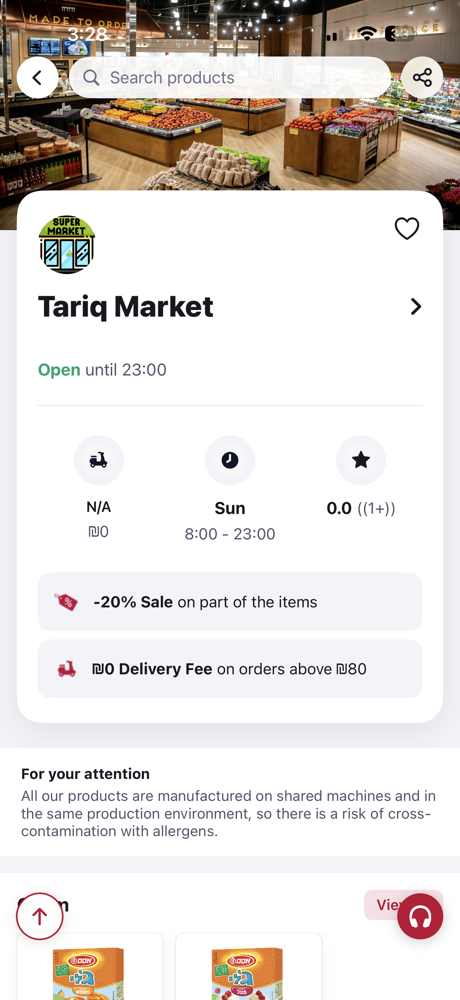
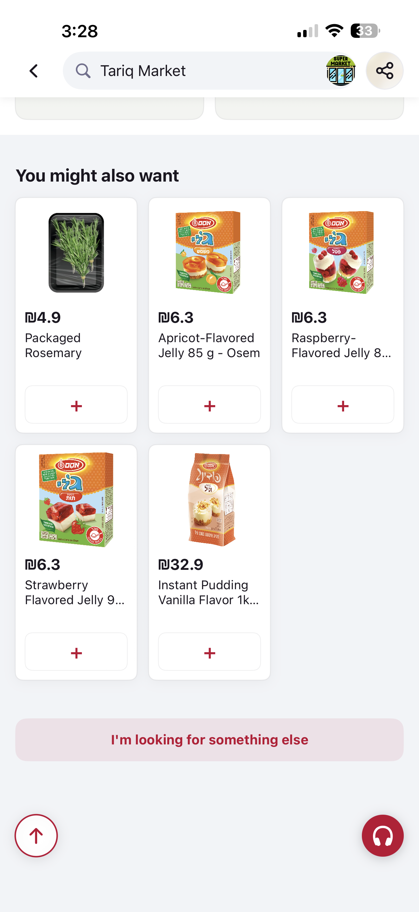
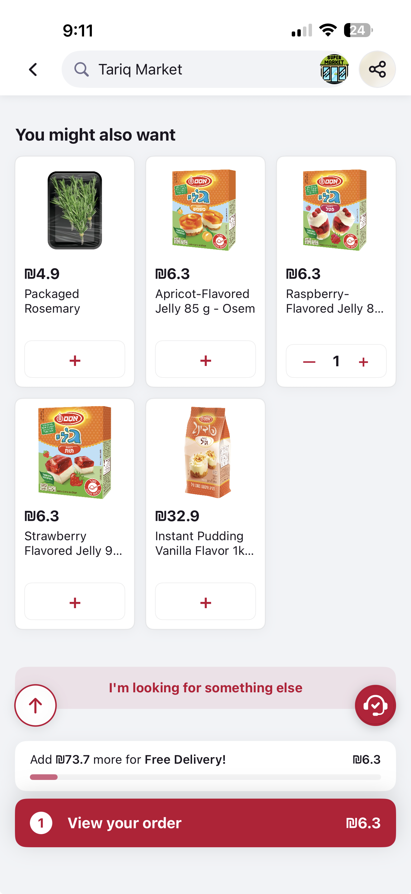

# Haat Delivery Venue Screen - iOS Assignment

My implementation of the Haat Delivery Venue Screen, built natively in SwiftUI as part of the iOS engineering assignment.

## 🏗️ Architecture & Approach
- **Pattern:** MVVM (Model-View-ViewModel) for a clean, testable codebase.
- **Concurrency:** Leveraged modern Swift `async/await` and `@MainActor` for thread-safe UI updates.
- **Networking:** Built a lightweight `URLSession` layer (no 3rd party libraries) with robust image caching and error handling.
- **Data Safety:** Implemented 100% Optional Codable models to handle any backend data variations without risk of crashes.

## ✨ Implementation Highlights
- **Figma Precision:** Focused on every detail from the provided designs—spacing, typography, and color tokens were carefully matched.
- **Custom Animations:** 
    - **Fly-to-Cart:** A custom global animation layer that tracks product image coordinates to fly them into the cart badge.
    - **Sticky Header:** The search bar and venue logo transition smoothly based on the scroll position.
    - **Interactive Feedback:** Integrated haptics and spring animations for a more tactile user experience.

## 🚀 Added Features
- **Product Detail Bottom Sheet**: Allows users to see full descriptions and larger images comfortably without losing their place in the main list. It stays perfectly in sync with the cart state.
- **Free Delivery Progress Tracker**: A dynamic visual indicator in the cart area that shows how much more a user needs to spend to unlock free delivery (₪80 threshold), improving conversion and UX.

## 📸 Screenshots

| Venue Screen | Product List | Product Detail |
|:---:|:---:|:---:|
|  |  |  |

## 🛠️ How to Run
1. Open `Haat.xcodeproj` in Xcode 15+.
2. Build and run (`Cmd + R`) on any iPhone simulator.
3. No external dependency management (SPM/Pods) required.
